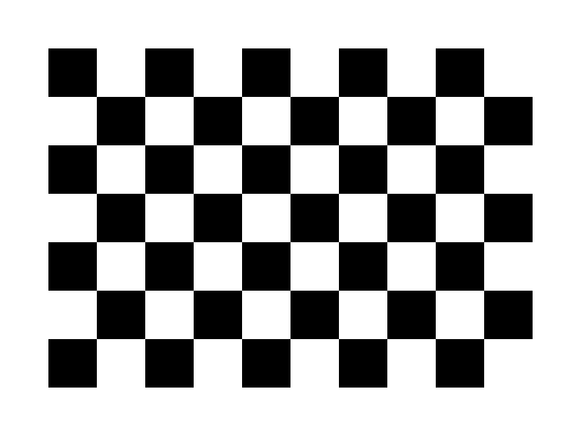

# AR Chessboard — Realidad Aumentada con OpenCV + OpenGL (C++17)

Aplicación de Realidad Aumentada basada en marcadores que detecta un patrón
de tablero de ajedrez (Chessboard) con **OpenCV** y renderiza modelos 3D
perfectamente alineados sobre él con **OpenGL moderno** (core profile 3.3,
VAO/VBO/EBO y shaders propios). Sin motores gráficos externos ni bibliotecas
de AR: todo el pipeline (detección → calibración → pose → render) está
implementado en este repositorio.



---

## 1. Tecnologías

| Componente | Uso |
|---|---|
| C++17 | Lenguaje de todo el proyecto |
| OpenCV 4.x | Captura, detección del tablero, calibración, solvePnP |
| OpenGL 3.3 core | Renderizado (sin immediate mode) |
| GLFW | Ventana, contexto OpenGL y teclado |
| GLAD | Carga de funciones OpenGL (incluido en `external/glad`) |
| GLM | Matrices, cuaterniones y transformaciones |
| CMake ≥ 3.16 | Sistema de compilación multiplataforma |

---

## 2. Estructura del proyecto

```
proyecto_opcv_3d/
├── CMakeLists.txt              # build multiplataforma (Windows/Linux/macOS)
├── src/
│   ├── main.cpp                # bucle principal y orquestación del pipeline
│   ├── Config.h                # constantes: tamaño del tablero, suavizado...
│   ├── Camera.{h,cpp}          # captura: webcam o imagen de disco
│   ├── ChessboardDetector.{h,cpp}  # findChessboardCorners + cornerSubPix
│   ├── Calibration.{h,cpp}     # calibrateCamera + YAML + undistort
│   ├── PoseEstimator.{h,cpp}   # solvePnP + suavizado (slerp de cuaterniones)
│   ├── Renderer.{h,cpp}        # ventana GLFW, fondo de cámara, escena 3D
│   ├── Shader.{h,cpp}          # compilación/enlace de shaders GLSL
│   └── Model.{h,cpp}           # mallas GPU (VAO/VBO/EBO): cubo, pirámide, ejes
├── utils/
│   └── MathUtils.{h,cpp}       # conversiones OpenCV -> OpenGL (vista/proyección)
├── external/glad/              # loader de funciones OpenGL (autocontenido)
└── resources/
    ├── shaders/                # GLSL: background, model (iluminado), axes
    ├── calibration/            # camera_params.example.yml (formato de ejemplo)
    ├── images/                 # chessboard_9x6.png (patrón imprimible/prueba)
    ├── models/                 # modelos glTF externos (tecla 6)
    └── textures/               # (reservado)
```

---

## 3. Compilación

### Requisitos previos

- **OpenCV 4.x** instalado en el sistema (con módulos `core`, `imgproc`,
  `imgcodecs`, `videoio`, `calib3d`).
- **GLFW** y **GLM**: si no están instalados, CMake los **descarga
  automáticamente** con FetchContent (necesita internet en la primera
  configuración).
- **GLAD** ya está incluido en `external/glad` (no requiere generación).

### Linux (Ubuntu/Debian)

```bash
sudo apt install build-essential cmake libopencv-dev libglfw3-dev libglm-dev
cd proyecto_opcv_3d
cmake -S . -B build -DCMAKE_BUILD_TYPE=Release
cmake --build build -j
./build/ar_chessboard
```

### Windows (Visual Studio + vcpkg)

```powershell
vcpkg install opencv4 glfw3 glm
cd proyecto_opcv_3d
cmake -S . -B build -DCMAKE_TOOLCHAIN_FILE=C:/vcpkg/scripts/buildsystems/vcpkg.cmake
cmake --build build --config Release
build\Release\ar_chessboard.exe
```

### macOS (Homebrew)

```bash
brew install cmake opencv glfw glm
cd proyecto_opcv_3d
cmake -S . -B build -DCMAKE_BUILD_TYPE=Release
cmake --build build -j
./build/ar_chessboard
```

> macOS usa OpenGL 4.1/3.3 core de forma nativa; el proyecto crea el
> contexto con `GLFW_OPENGL_FORWARD_COMPAT`, requisito de Apple.

---

## 4. Ejecución y uso

```bash
./ar_chessboard                                     # webcam 0
./ar_chessboard --camera 1                          # otra webcam
./ar_chessboard --image resources/images/chessboard_9x6.png   # imagen fija
./ar_chessboard --calib mi_calibracion.yml          # calibración alternativa
```

1. **Imprime el patrón** `resources/images/chessboard_9x6.png`
   (10×7 cuadrados = **9×6 esquinas internas**) y pégalo sobre una
   superficie rígida y plana. El tamaño del patrón se cambia en
   `src/Config.h` (`BOARD_COLS`, `BOARD_ROWS`, `SQUARE_SIZE`).
2. Al arrancar, si no existe `resources/calibration/camera_params.yml`, la
   aplicación usa **intrínsecos aproximados** (FOV ≈ 60°): el objeto ya se
   ancla al tablero, aunque con precisión limitada.
3. **Calibra tu cámara** para una alineación exacta: muestra el tablero
   desde ángulos y distancias variados y pulsa **C** en cada postura
   (mínimo 10 vistas); después pulsa **K**. El RMS del error de
   reproyección se imprime en consola y los parámetros se guardan en YAML,
   que se recarga automáticamente en próximos arranques.

### Controles

| Tecla | Acción |
|---|---|
| `1` | Mostrar cubo (rojo) |
| `2` | Mostrar pirámide (verde) |
| `3` | Mostrar **Pikachu** |
| `4` | Mostrar **Raichu** |
| `5` | Mostrar **Pikachu + Raichu** |
| `6` | Mostrar **modelo glTF** (PC retro de Sketchfab) |
| `SPACE` | Congelar / descongelar la imagen |
| `R` | Reiniciar detección (filtro de pose, descongela) |
| `C` | Capturar vista de calibración |
| `K` | Ejecutar calibración y guardar YAML |
| `ESC` | Salir |

El HUD muestra en pantalla: FPS, estado del chessboard, pose encontrada
(tvec y distancia), modelo actual, resolución y estado de calibración.

### Modelos glTF propios (Sketchfab)

La tecla `6` muestra un modelo externo en formato **glTF 2.0**, cargado con
el parser de cabecera única [cgltf](https://github.com/jkuhlmann/cgltf)
(`external/cgltf/`). Para usar tu propio modelo:

1. En Sketchfab descarga con la opción **glTF** y descomprime el zip.
2. Copia la carpeta (con `scene.gltf`, `scene.bin` y `textures/`) dentro de
   `resources/models/`.
3. Ajusta `GLTF_MODEL_PATH` en `src/Renderer.cpp` a la nueva ruta.

El loader hornea las transformaciones de los nodos, convierte de Y-arriba
(glTF) a Z-arriba (tablero), centra el modelo, lo apoya en el plano del
tablero y lo escala a `GLTF_TARGET_SIZE` cuadrados. Usa la primera textura
baseColor (suficiente para modelos con atlas único, lo habitual en
Sketchfab); los formatos .fbx/.usdz no están soportados.

---

## 5. Cómo funciona (explicación detallada)

### 5.1 Detección del Chessboard

*(código: `ChessboardDetector.cpp`)*

1. El frame se convierte a escala de grises.
2. **Camino rápido — detector clásico** `cv::findChessboardCorners()` con
   `ADAPTIVE_THRESH + NORMALIZE_IMAGE + FAST_CHECK` y refinamiento
   **subpíxel** con `cv::cornerSubPix()`. Es el caso normal (tablero
   razonablemente de frente): ~3-4 ms por frame a 1280×720, y `FAST_CHECK`
   descarta rápido los frames sin tablero para no hundir el frame-rate.
3. **Fallback robusto — `cv::findChessboardCornersSB()`** (sector-based,
   OpenCV ≥ 4) cuando el clásico falla: es mucho más robusto ante
   **perspectiva extrema**, desenfoque y baja iluminación. Para que no sea
   prohibitivo (a resolución completa con `EXHAUSTIVE` cuesta 133-215
   ms/frame, ≈5 FPS) se ejecuta a **media resolución** con contraste
   realzado por **CLAHE**; las esquinas encontradas se reescalan ×2 y se
   refinan con `cornerSubPix` sobre la imagen completa, recuperando la
   precisión subpíxel.
4. En ambos casos las esquinas quedan **ordenadas fila a fila**, lo que
   permite emparejarlas 1:1 con los puntos 3D conocidos del tablero, y se
   dibujan con `cv::drawChessboardCorners()`.

### 5.2 Cálculo de la pose

*(código: `PoseEstimator.cpp`)*

El tablero define su propio sistema de coordenadas: la primera esquina
interna es el origen, X recorre las columnas, Y las filas y Z=0 (es plano).
Con las N correspondencias 3D↔2D y los intrínsecos `K`,
`cv::solvePnP()` (método **IPPE**, especializado en objetos planos) calcula
la transformación rígida que lleva puntos del tablero a la cámara:

```
X_cam = R · X_obj + t        (R como rvec de Rodrigues, t como tvec)
```

**Suavizado:** el ruido de detección produce jitter. La traslación se
filtra con una media exponencial (`mix`) y la rotación se convierte a
**cuaternión** y se interpola con **slerp** (interpolar rvecs linealmente es
incorrecto: el espacio de rotaciones no es lineal). El factor
`POSE_SMOOTHING_ALPHA` (Config.h) controla el compromiso estabilidad/lag.
Si la detección falla unos pocos frames se conserva la última pose
(periodo de gracia) para evitar el parpadeo del modelo.

### 5.3 Transformación de OpenCV hacia OpenGL

*(código: `utils/MathUtils.cpp`)*

OpenCV y OpenGL usan convenciones de cámara distintas:

```
OpenCV: +X derecha, +Y abajo,  +Z delante (la cámara mira +Z)
OpenGL: +X derecha, +Y arriba, +Z hacia el espectador (mira −Z)
```

El cambio de base es una rotación de 180° sobre X: `F = diag(1,−1,−1,1)`.

- **Matriz de vista:** `V = F · [R|t]`, es decir, se niegan las filas 2ª y
  3ª de `R` y de `t`. Además `cv::Mat` es *row-major* y GLM *column-major*,
  por lo que el volcado transpone el almacenamiento.
- **Matriz de proyección:** se construye desde `K` para que la cámara
  virtual proyecte **exactamente igual** que la real. Partiendo del modelo
  pinhole `u = fx·X/Z + cx` y reescribiéndolo en coordenadas NDC de OpenGL
  (`x_ndc = 2u/w − 1`, `y_ndc = 1 − 2v/h`, `w_clip = −Z_gl`):

```
        | 2fx/w    0      1−2cx/w        0      |
  P  =  |  0     2fy/h    2cy/h−1        0      |
        |  0       0    −(f+n)/(f−n)  −2fn/(f−n)|
        |  0       0        −1            0     |
```

Nótese que el centro óptico `(cx,cy)` casi nunca es el centro exacto de la
imagen: esta matriz lo respeta, cosa que `glm::perspective` no puede hacer.

**Distorsión:** antes de detectar, el frame se rectifica con
`initUndistortRectifyMap` + `remap` (`Calibration::undistort`). Así el fondo
y la proyección corresponden a una cámara pinhole ideal y `solvePnP` se
ejecuta con distorsión cero: la alineación es coherente en toda la imagen,
incluidas las esquinas.

### 5.4 Renderizado del modelo

*(código: `Model.cpp`, `Renderer.cpp`, `resources/shaders/`)*

Todo el render usa OpenGL moderno, sin `glBegin/glEnd`:

1. Los vértices (posición + normal, o posición + color) se suben una única
   vez a un **VBO**; los índices de triángulos a un **EBO**; el **VAO**
   registra el layout de atributos.
2. En cada frame, el **vertex shader** (`model.vert`) transforma cada
   vértice con `P · V · M` y pasa la normal en espacio de mundo
   (con la matriz normal `transpose(inverse(M))`).
3. El **fragment shader** (`model.frag`) aplica iluminación básica:
   ambiente + luz principal (*key*) difusa lambertiana + una luz de relleno
   (*fill*) tenue desde el lado opuesto, para que la cara que mira a la
   cámara no quede plana.
4. Geometrías: **cubo rojo** (24 vértices, normales por cara),
   **pirámide verde** (base cuadrada + 4 caras triangulares) y
   **ejes XYZ** (líneas: X rojo, Y verde, Z azul, sin iluminación).
   Como en la convención OpenCV el +Z del tablero apunta *hacia dentro*
   de la mesa, la matriz de modelo gira los objetos 180° sobre X para que
   se eleven hacia la cámara.
5. **Personajes procedurales Pikachu y Raichu** (`Renderer.cpp`): se
   construyen ensamblando **primitivas suaves** (elipsoides, conos y cajas,
   con `Model::createEllipsoid/createCone/createBox` y normales analíticas
   correctas). Cada personaje es una lista de piezas coloreadas
   (`ModelPart`), dibujadas con el mismo shader iluminado fijando
   `uObjectColor` por pieza. Así se obtiene un modelo reconocible **sin
   depender de archivos `.obj` externos ni de assets con copyright**.

### 5.5 Sincronización de la cámara con OpenGL

*(código: `Renderer.cpp`)*

1. **Fondo:** cada `cv::Mat` BGR se convierte a RGB y se sube a una textura
   (`glTexSubImage2D`, la reserva se hace una sola vez). Se dibuja sobre un
   quad a pantalla completa **con el test de profundidad desactivado**, de
   modo que siempre queda detrás. La coordenada V se invierte en el quad
   porque OpenCV almacena la fila 0 arriba y OpenGL muestrea v=0 abajo.
2. **Cámara virtual = cámara real:** al usar la vista de `solvePnP` y la
   proyección derivada de `K`, cualquier punto del tablero se proyecta en el
   **mismo píxel** en el render y en la foto: el objeto queda "pegado" al
   tablero aunque éste se mueva o rote.
3. **Estabilidad:** double buffering + V-Sync (sin flickering ni tearing),
   ventana del tamaño exacto del frame (sin deformación), viewport con el
   tamaño real del framebuffer (soporte HiDPI/Retina) y suavizado de pose
   (sin vibración).

---

## 6. Archivos de calibración

Formato YAML generado con `cv::FileStorage`
(ejemplo en `resources/calibration/camera_params.example.yml`):

```yaml
%YAML:1.0
camera_matrix: !!opencv-matrix       # K (3x3): fx, fy, cx, cy
distortion_coefficients: !!opencv-matrix  # k1 k2 p1 p2 k3
avg_reprojection_error: 0.34         # RMS en píxeles (menor = mejor)
```

La aplicación busca por defecto `resources/calibration/camera_params.yml`.
Para probar el formato sin calibrar: copia el `.example.yml` con ese nombre
(la alineación exacta requiere calibrar **tu** cámara).

---

## 7. Parámetros configurables (`src/Config.h`)

| Constante | Valor | Descripción |
|---|---|---|
| `BOARD_COLS` × `BOARD_ROWS` | 9 × 6 | Esquinas internas del patrón |
| `SQUARE_SIZE` | 1.0 | Lado del cuadrado (define la escala del mundo) |
| `POSE_SMOOTHING_ALPHA` | 0.5 | 1.0 = sin suavizado; menor = más estable |
| `MIN_CALIBRATION_FRAMES` | 10 | Vistas mínimas para calibrar |
| `NEAR_PLANE` / `FAR_PLANE` | 0.1 / 1000 | Planos de recorte |

---

## 8. Solución de problemas

- **"No se pudo abrir la webcam"**: prueba `--camera 1`, cierra otras
  aplicaciones que usen la cámara y, en macOS, concede permiso de cámara al
  terminal (Ajustes → Privacidad → Cámara).
- **No detecta el tablero**: el patrón necesita **borde blanco** alrededor,
  buena iluminación sin reflejos y estar completamente dentro del encuadre.
  Verifica que `BOARD_COLS/ROWS` coincide con las esquinas *internas* del
  patrón impreso.
- **El objeto no queda perfectamente alineado**: calibra la cámara (C×10 +
  K). Con intrínsecos aproximados la alineación es solo orientativa.
- **GLFW/GLM no se encuentran y no hay internet**: instálalos con el
  gestor de paquetes del sistema (apt/brew/vcpkg) y reconfigura.
